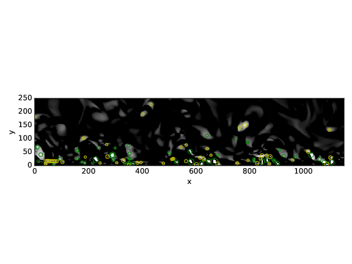
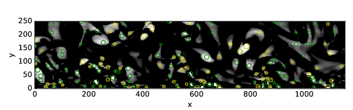
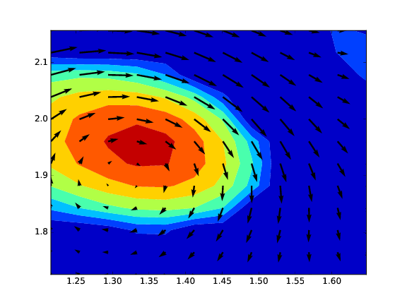

Methodology
===========

The methodology used in this work to characterize the coherent structures are
divided in three main steps: the calculation of a local function to detect the
vortex; the localization of the maxima of this function; and the adjustment
(fitting) of this field to the proposed model.

Detection methods
-----------------
In this section, the detection methods implemented in the code for vortex
identification are presented. These methods are based on the velocity gradient
tensor, :math:`\overline{D}`, that can be written as:


.. math::
   D_{ij} = \frac{\partial u_i}{\partial x_j}

As this is a second order tensor, it can be decomposed into a symmetric and
anti-symmetric part, :math:`D_{ij} = S_{ij} + \Omega_{ij}` where:

.. math::
   S_{ij} = \frac{1}{2} \left(\frac{\partial u_i}{\partial x_j} +
   \frac{\partial u_j}{\partial x_i}\right)

.. math::
   \Omega_{ij} = \frac{1}{2} \left(\frac{\partial u_i}{\partial x_j} -
   \frac{\partial u_j}{\partial x_i}\right)

:math:`S_{ij}` is known as the rate-of-strain tensor and :math:`\Omega_{ij}` is the
vorticity tensor.

The characteristic equation for :math:`\nabla u` is given by

.. math::
   \lambda^3 + P \lambda^2 + Q \lambda + R = 0

where P, Q and R are the three invariants of the velocity gradient tensor. Using
the decomposition into symmetric and anti-symmetric parts, these invariants
can be expressed as:

.. math::
   
   P = -tr(\bar{D})

.. math::
   Q = \frac{1}{2} (tr(\bar{D})^2 -tr(\bar{D}^2)) = \frac{1}{2} (\|\Omega\|^2 -\|S\|^2)

.. math::
   R = -det(\bar{D})

Q criterion
-----------

The Q criterion proposed by Hunt *et al* (1988) [HUNT1988]_ identifies the vortices
as flow regions with positive second invariant of $\nabla u$. An additional
condition is that the pressure in the eddy region should to be lower than the
ambient pressure. Chakraborty *et al* (2005) [CHAKRA2005]_ quoted "in
an incompressible flow Q is a local measure of the excess rotation rate relative
to the strain rate".

In practical terms, the vortex is detected in case of the second invariant  :math:`Q > 0`.

:math:`\Delta` criterion
------------------------

Chong *et al* (1990) [CHONG1990]_ define a vortex core to be the region where 
:math:`\nabla v` has complex eigenvalues. In order to determine if the eigenvalues
are complex, we examine the discriminant of the characteristic equation, considering
the flow incompressible (P = 0).

.. math::
   \Delta = \left(\frac{Q}{3}\right)^3 + \left(\frac{R}{2}\right)^2 > 0


Swirling strength criterion
---------------------------

The swirling strength criterion (:math:`\lambda_{ci}`) was developed by Zhou
*et al* (1999) [ZHOU1999]_. It defines a vortex core to be the region where
:math:`\nabla v` has complex eigenvalues. It is based on the idea that the
velocity gradient tensor in Cartesian coordinates can be decomposed as:

.. math::
   \nabla u = [\bar{\nu_r} \bar{\nu_{cr}} \bar{\nu_{ci}}]^T
   \left[\begin{array}{ccc}
   \lambda_r & 0 & 0 \\
   0 & \lambda_{cr} & \lambda{ci} \\
   0 & -\lambda{ci} & \lambda{cr} \end{array}\right]
   [\bar{\nu_r} \bar{\nu_{cr}} \bar{\nu_{ci}}]^T

where :math:`\lambda_r` is the real eigenvalue, related to the eigenvector
:math:`\bar{\nu_r}`, and the complex conjugate pair of complex eigenvalues is
:math:`\lambda_{cr}  \pm i\lambda_{ci}`, related to the eigenvectors
:math:`\bar{\nu_r} \pm i\bar{\nu_{ci}}`. The strength of this swirling motion can
be quantified by :math:`\lambda_{ci}`, called the local swirling strength of the
vortex. The threshold for :math:`\lambda_{ci}` is not well-defined, but theoretically
any value greater than zero should be considered a vortex. Experimental results
[ZHOU1999]_ shows that :math:`\lambda_{ci} \geq \epsilon > 1.5` give smoother results.


Localization of the extrema
---------------------------

To have smooth results on the swirling strength, we apply a normalization of the
field. The swirling strength is divided by the wall-normal profile of its RMS value:

.. math::
   \bar{\lambda}_{ci}(x_{1/3},x_2) = \frac{\lambda_{ci}(x_{1/3},x_2)}{\lambda_{ci,RMS}(x_2)}

Then the local maxima of the detection can be identified. The normalization is
not required for the HIT cases, it is only used when we have an non-homogeneous
direction.

In figure :numref:`nonnorm2` we see the original swirling strength field, where
104 vortices were found, mostly near the wall, where the boundary layer plays an
important role in increasing the swirling strengtht. The yellow circles corresponds
to the vortices rotating clockwise and the green circles for the counter-clockwise
rotation. 

.. _nonnorm2:


In figure :numref:`norm2` we show the fluctuation of the swirling strength field,
by applying the Reynolds decomposition, now with 202 vortices found, minimizing
the wall influence over the detection.

.. _norm2:
.. figure:: _images/PIVnormalized.png
   :align: center

We can play with the distance between one detected vortex and another, by increasing
the box size of the peak detection. In figure :numref:`boxnorm2` we set the box size
to 12, instead of box size 6 used in figures :numref:`nonnorm2` and :numref:`norm2`.
With this setting we reduce the detected vortices to 154, by removing the overlapping
ones.

.. _boxnorm2:


One interesting fact about the swirling strength (as well the other methods) is
that the local maximum values does not always match the center of the vortex. We
show in :numref:`quiverDNS1` one example of this mismatch between them.

.. _quiverDNS1:


Fitting of coherent structures
------------------------------

Using the peak of maximum swirling strength or identifying the places where the
Q or :math:`\Delta` criterion are higher than 0 gives us a rough estimation of a possible
vortex and its center. But even using a threshold on these methods, the presence
of a real vortex is not always true. To improve this detection we use a Lamb-Oseen
vortex model to be fitted on top of the actual detected peak to check if it is
really a vortex. 

The correlation coefficient between the fitted model and the velocity field is calculated according to equation \ref{eq:corr} and if it's higher than 0.75 we can consider it a vortex.

.. math::
   R(model/data) = \frac{\langle u_{model} \cdot u_{data} \rangle +
                         \langle u_{model} \cdot u_{data} \rangle}
                        {MAX(\langle u_{model} \cdot u_{model} +
                              v_{model} \cdot v_{model}  \rangle, 
                             \langle u_{data} \cdot u_{data} +
                              v_{data} \cdot v_{data}\rangle)}
..   \label{eq:corr}
   R(model/data) = \left( \frac{\langle (\vec{u}_{data}-\vec{u}_c).(\vec{u}_{model}
   -\vec{u}_c)\rangle }{\sqrt{\langle (\vec{u}_{data}-\vec{u}_c)^2\rangle}
   \sqrt{\langle (\vec{u}_{model}-\vec{u}_c)^2\rangle}} \right)^{1/2}

Lamb-Oseen vortex
-----------------

The Lamb-Oseen vortex is a mathematical model for the flow velocity in the
circumferential direction ($\theta$), shown in equation \ref{eq:oseenDecay}. It
models a line vortex that decays due to viscosity.

.. math::
   \label{eq:oseenDecay}
   \vec{u}_\theta(r,t) = \frac{\Gamma}{2\pi r} \left( 1 - exp \left(
   -\left(\frac{r}{r_0(t)}\right)^2\right)\right) \vec{e}_{\theta}

where $r$ is the radius, $r_0 = \sqrt{4 \nu t}$ is the core radius of vortex,
$\nu$ is the viscosity and $\Gamma$ is the circulation contained in the vortex. 

In this work we are dealing with a time-independent flow, so we have no decaying
due to viscosity. And since the coherent structures are in movement, we add the
convective velocity to the Lamb-Oseen vortex model shown in equation \ref{eq:oseen}.  

.. math::
   \label{eq:oseen}
   \vec{u}(r,\theta) = \vec{u}_c + \frac{\Gamma}{2\pi r} \left( 1 - exp \left(
   -\left(\frac{r}{r_0}\right)^2\right)\right) \vec{e}_{\theta}

Non-linear least squares
------------------------

Levenberg Marquardt method
``````````````````````````

The Levenberg–Marquardt algorithm, also known as the damped least-squares method,
is used to solve non-linear least squares problems. These minimization problems
arise especially in least squares curve fitting.

.. math::
   \chi^2 = \sum_{i=1}^N \left[ \frac{y_i - \sum_{k=1}^M a_k X_k (x_i)}{\sigma i} \right]^2

.. math::
   \alpha_{kl} = \sum_{i=1}^N \frac{1}{\sigma_i^2} \left[ \frac{\partial y(x_i;a)}{\partial a_k} \frac{\partial y(x_i;a)}{\partial a_l} \right]

Powell's dogleg method
``````````````````````

The Powell's method is an algorithm for finding a local minimum of a function.
This function doesn't need to be differentiable and no derivatives are taken. It
does this using a combination of Newton's method and the steepest descent method.
This is a so-called trust region method. This means that every step moves the
current point to within a finite region. This makes the method more stable than
Newton's method.


.. [HERPIN2009] Sophie Herpin.
   *Étude de linfluence du nombre de Reynolds sur lorganisation de la turbulence
   de paroi.* PhD thesis, Ecole Centrale de Lille, 2009.

.. [ZHOU1999] Zhou J., Adrian R. J., Balachandar S., and Kendall T. M.
   *Mechanisms for generating coherent packets of hairpin vortices in channel flow.*
   J. Fluid Mech., 387:353–396, 1999.

.. [CHAKRA2005] Chakraborty P., Balachandar S., and Adrian R. J. 
   *On the relationships between local vortex identification schemes.*
   J. Fluid Mech., 535:189–214, 2005.

.. [CHONG1990] Chong M. S., Perry A. E., and Cantwell B. J. 
   *A general classification of three-dimensional flow fields.*
   Phys. Fluids, 2:765–777, 1990.

.. [HUNT1988] Hunt, J. C. R., Wray, A. A. & Moin, P.
   *Eddies, stream, and convergence zones in turbulent flows.*
   Center for Turbulence Research Report, CTR-S88, 1988

