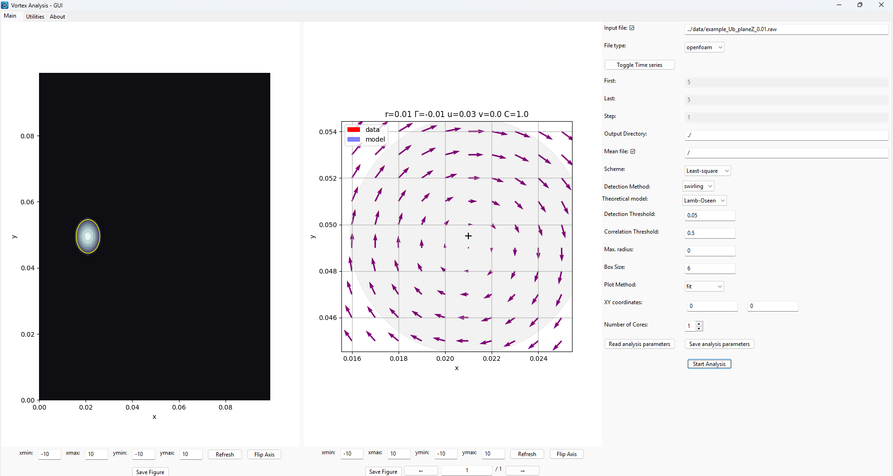
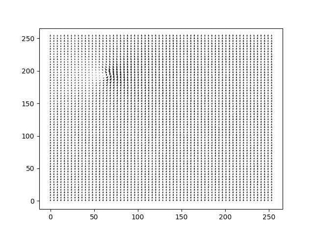

Software options
================

Graphical User Interface (GUI)
------------------------------

The GUI contains 3 panels: 

* Main panel: to perform vortex fitting
* Utilities: tools to generate a custom vortex and to convert files (netCDF <-> ASCII format)
* About: displays information about the code


.. _gui_vortexfitting:

   
   Main page of the VortexFitting Gui
   
The main page displays 2 figures: the left one for the global vorticity field, 
the right one for the detected vortex.  
 
When several vortices are found, one can sweep between the different vortices, 
with the arrows behind the figure.

Each figure can be resized with a specific interface below, and can be exported.

The right side panel lists all the options needed to perform **VortexFitting**.
Those parameters are stored in a config file (.cfg format), 
which can be loaded or saved with the bottom buttons.

One can 


How to use the code / detection and fitting options
---------------------------------------------------

Data input
``````````

The data used can be of different format.
For NetCDF, the axis of the velocity components are ordered like z, y, x, 
where z can also be the number of samples in a 2D field.

Tecplot format (.dat), OpenFOAM (.raw) or HDF5 (.h5) export are also accepted.

If you want to implement a custom format, change the variable names, their order ...
it should be directly changed in the **class.py** file


Parameters
``````````

The code comes with default test cases, located in *../data/*.

If no input file with the *-i* (*--input*) argument has been specified, the *example_dataHIT.nc* will be used.

.. code-block:: bash
   
   $ vortexfitting

If we want to define a threshold for the swirling strength, we can specify with
the *-t* (*--threshold*) argument, like this:

.. code-block:: bash

   $ python3 vortexfitting.py -t 0.5

The differencing scheme can be changed with the *-s* (*--scheme*) argument:

.. code-block:: bash

   $ python3 vortexfitting.py -s Fourth-order

.. note:: Available schemes:
          
          * Second-order
          * Least-square filter (default)
          * Fourth-order

We can as well change the detection method with the *-d* (*--detect*) argument

.. code-block:: bash

   $ python3 vortexfitting.py -d Q

.. note:: Available methods:
          
          * Q - Q criterion
          * swirling - Swirling Strenght criterion (default)
          * delta - Delta criterion

If you want to write the detection field, the *write_field* function from the 
**output.py** module should be useful: it can be used in **__main__.py**.

An initial guessing radius can be set with *-rmax* argument. 

.. code-block:: bash

   $ python3 vortexfitting.py -rmax 15

An output directory can be specified with the *-o* (*--output*) argument. 

.. code-block:: bash

   $ python3 vortexfitting.py -o ../results/MY_DIRECTORY

Use arguments *-first*, *-last* and *-step* to analyze a set of images. Default for *-step* is 1.

For example, if you want to compute from image #10 to #20, each 2 images, enter:

.. code-block:: bash

   $ python3 vortexfitting.py -first 10 -last 20 -step 2


By default, the correlation threshold to detect a vortex is 0.75. This value may be changed with the
*-ct* (*--corrthreshold*) argument.

.. code-block:: bash

   $ python3 vortexfitting.py -ct 0.85

To avoid vortices overlapping, the box size parameter *-b* (*--boxsize*) can be used. 
It takes an integer distance in mesh units, between two vortex centers.

.. code-block:: bash

   $ python3 vortexfitting.py -b 10


The plot method is chosen with the *-p* (*--plot*) argument

.. note:: Available methods:
          
          * fit - detection and fitting, saves images (default)
          * detect - Locate the potential vortices (without fitting)
          * fields - display the velocity fields and vorticity

.. code-block:: bash

   $ python3 vortexfitting.py -p fields

Parallelization
```````````````

Parallelization has been added to VortexFitting since V2.0.0. It is useful on huge dataset. 

The core numbers can be specified by the *-nc* (*--corenumber*) argument.

.. code-block:: bash

   $ python3 vortexfitting.py -nc 8
   
It has been tested on the Gust experiment dataset from [TOWNE2023B]_: the example file is about 11.4 Go. 

For a specific time step (here t = 5), 283 vortices are detected. 

Parameters are: swirling and least-square filter methods, with a Lamb-Oseen model, a boxsize of 6, detection threshold of 0.01, 
and correlation threshold of 0.5. 

The tests are run on a Windows computer, with 64 Go of RAM and 32 available cores. 

The effect of parallelization is provided in te following table:

.. _TablePar:
.. table:: Effect of parallelization

    +----------------+------------------+----------+----------+
    |Number of cores | Elapsed time (s) | Speed-up | Gain (%) | 
    +================+==================+==========+==========+
    |1               |43.018            | 1.0×     | 0%       |
    +----------------+------------------+----------+----------+
    |2               |15.709            | 2.7×     | 63.5%    |
    +----------------+------------------+----------+----------+
    |4               |9.475             | 4.5×     | 78.0%    |
    +----------------+------------------+----------+----------+
    |8               |7.262             | 5.9×     | 83.1%    |
    +----------------+------------------+----------+----------+
    |16              |20.885            | 2.1×     | 51.5%    |
    +----------------+------------------+----------+----------+


Data output
```````````

The results will be written to the *../results/* folder with the following files:

* accepted.svg: The location and size of the accepted vortices
* linked.svg: same as *accepted.svg* but can be open on the web browser with
  clickable vortices
* vortex#_initial_vfield.png: Comparison of the velocity field of the vortex and the model
* vortex#_advection_field_subtracted.png: Comparison of the velocity field of the vortex and the model,
  subtracting the advection velocity
* vortices.dat: parameters of all the detected vortices

If you want to update the output format of *vortices.dat*, it should be done in the **output.py** file.

The format (png, pdf ...) can be specified with the *-of* (*--output_format*) option.

NB: the *vortices.dat* file is written according to the TecPlot format. 
It contains some auxiliary data, to keep a record of the different parameters used.

The plot results are handled in the **fitting.py** module.


Generating a custom Vortex
--------------------------

It's possible to generate a custom vortex using the **generateNetCDF.py** module.
It will create a NetCDF file with the same characteristics as the DNS HIT file.

.. code-block:: bash

   $ python3 generateNetCDF.py

This command will create a file *generatedField.nc* at the data folder.

You can tune the characteristics and position of the vortex by changing the 
following values directly on *generatedField.nc*:

* core_radius;
* gamma;
* x_center;
* y_center;
* u_advection;
* v_advection.

The size of the domain can also be changed on the *ndim* variable.

You can use the *output* option (*-o*) to specify the name of the created file, 
and *ndim* (*-ndim*) option to change the domain size.
For example:

.. code-block:: bash

   $ python3 generateNetCDF.py -o ./data/testGenerate.nc -ndim 300


will produce a 300x300 mesh, in a file named *testGenerate.nc*.

.. _generateNetCDF_vortex:

   
   Vortex produced with the **generateNetCDF.py** function

Converting NetCDF to ASCII (and vice-versa)
-------------------------------------------

If for any reason you need to convert a netCDF file to a text format (ASCII), the
module **convertToASCII.py** can do the job. It will open the *infile* and save
all z planes (or time) into separated files.

.. code-block:: bash

   $ python3 convertToASCII.py -i input.nc -o output.dat

Depending on the file you need to change the variable names like *velocity_x*
and such for the corresponding variable.

The module **convertToNC.py** can convert an ASCII file to a NetCDF4 format.
You can specify the spatial dimensions (*nx*, *ny* respectively for x and y directions),
with the options *-nx* or *-ny*

.. code-block:: bash

   $ python3 convertToNC.py -i input.dat -o output.nc
   
   
References
----------

.. [TOWNE2023B] Towne A., Dawson S. T., Brès G. A., Lozano-Duran A., Saxton-Fox T. , Parthasarathy A., Jones A. R., Biler H. , Yeh C.-A., Patel H. D., et al.
	*A database for reduced-complexity modeling of fluid flows.*, AIAA journal, 61 (7) 2867–2892, 2023.
